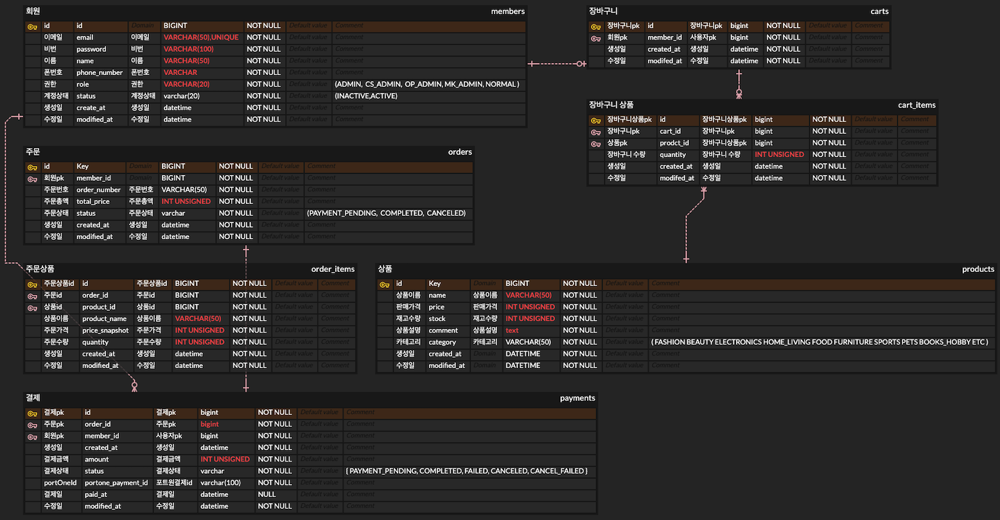
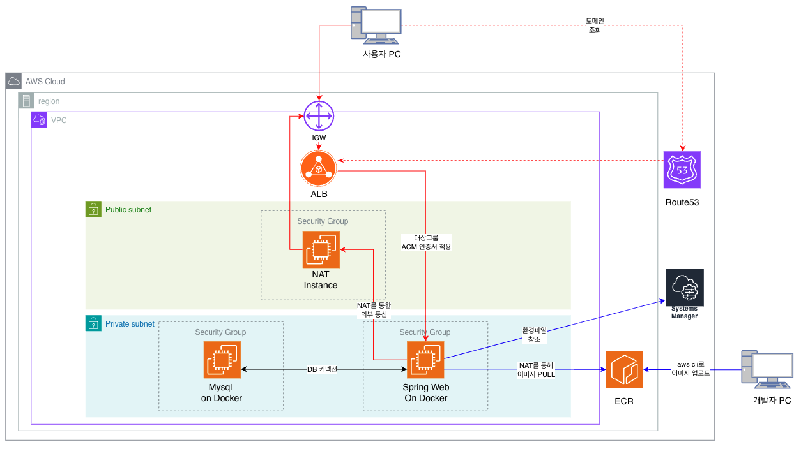
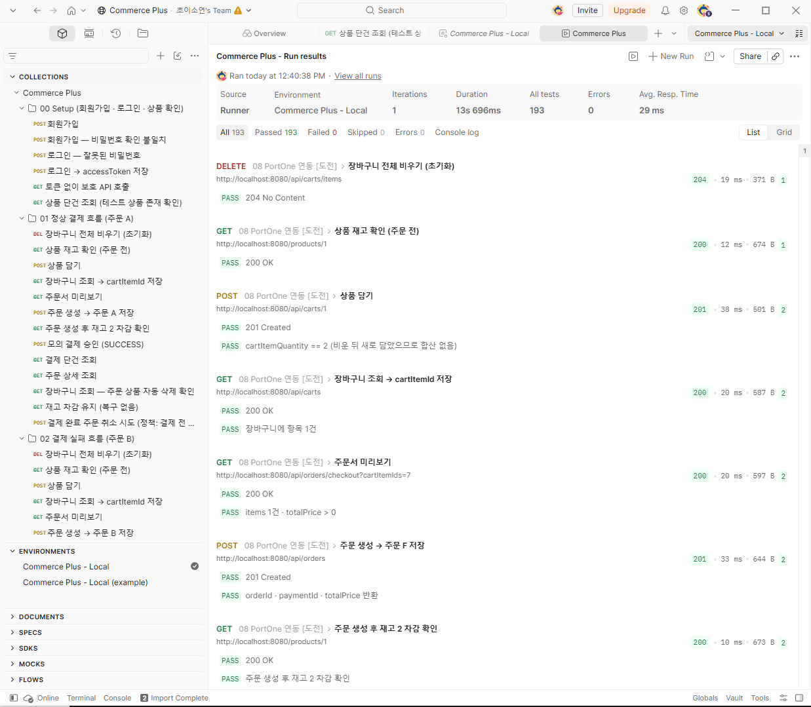
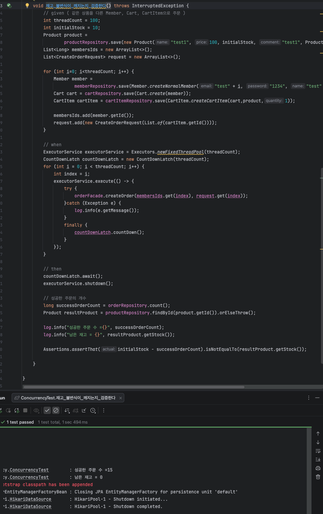
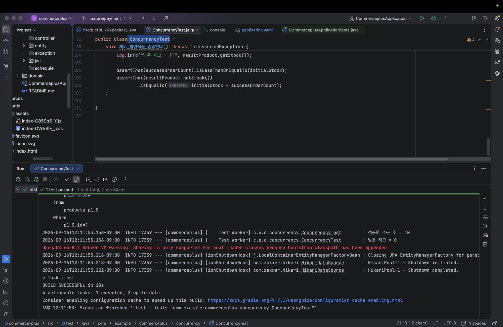

# 🛒 Commerce Plus

> **커머스의 기본 흐름부터 성능 최적화·동시성 제어·실결제 연동까지 단계적으로 확장한 이커머스 백엔드 시스템**

Spring Boot 백엔드를 중심으로 React 사용자 화면과 PortOne 실결제를 연결한
이커머스 프로젝트입니다.

상품 조회 → 장바구니 → 주문 → 결제로 이어지는 핵심 흐름을 구현하고,
조회 성능과 재고 동시성 문제를 직접 측정하여
인덱스·캐시·비관적 락을 적용했습니다.

실결제 단계에서는 클라이언트의 결제 결과를 그대로 신뢰하지 않고
PG 결제 정보를 서버에서 다시 검증하며,
외부 결제 성공 후 내부 처리 실패에 대한 보상 취소까지 고려했습니다.

### 핵심 성과

| 항목 | 적용 전 | 적용 후 |
| --- | --- | --- |
| 상품 검색 `5만 건` · 카테고리 + 최신순 | `26.0 ms` · Full Scan | `2.3 ms` · `(category, created_at)` 인덱스 |
| 상품 목록 반복 조회 | `35 ms` | `6 ms` · Caffeine Cache |
| 재고 `10개` · 동시 주문 `100건` | `15건 성공` · 초과 판매 | `10건 성공` · 최종 재고 `0` · 비관적 락 |

> 측정값은 프로젝트 테스트 환경을 기준으로 하며,
> 상세 검증 과정은 [10. 테스트 및 검증](#10-테스트-및-검증)에서 설명합니다.

---

## 목차

1. [프로젝트 소개](#1-프로젝트-소개)
2. [기술 스택](#2-기술-스택)
3. [핵심 흐름](#3-핵심-흐름)
4. [주요 기능](#4-주요-기능)
5. [ERD](#5-erd)
6. [API 명세](#6-api-명세)
7. [디렉토리 구조](#7-디렉토리-구조)
8. [인프라 아키텍처](#8-인프라-아키텍처)
9. [주요 기술적 구현](#9-주요-기술적-구현)
10. [테스트 및 검증](#10-테스트-및-검증)
11. [하지 않은 것과 그 이유](#11-하지-않은-것과-그-이유)
12. [협업 방식](#12-협업-방식)
13. [팀 구성 및 기여 내용 (R&R)](#13-팀-구성-및-기여-내용-rr)
14. [실행 방법](#14-실행-방법)

---

## 1. 프로젝트 소개

### 프로젝트 배경

앞선 결제 프로젝트에서는 외부 결제 연동에 집중하면서
그 기반이 되는 주문·재고·결제 구조를 충분히 다루기 어려웠습니다.

이번 프로젝트에서는 외부 연동보다 먼저
**상품 → 장바구니 → 주문 → 모의 결제 → 취소**의 기본 흐름을 완성하고,
그 위에 성능 최적화와 동시성 제어를 적용했습니다.

마지막으로 PortOne 실결제를 연결하여
외부 결제와 내부 주문·결제 상태가 함께 움직이는 구조로 확장했습니다.

### 프로젝트 목표

- Spring Security + JWT 기반 사용자 인증·인가
- 로그인 사용자 기준 리소스 소유권 검증
- QueryDSL 기반 상품 조건 검색 및 페이지네이션
- 장바구니 상품 추가·수량 변경·삭제
- 주문 생성 시 상품 재고 검증 및 선차감
- 주문 시점의 상품명·가격 스냅샷 저장
- 모의 결제 성공·실패 처리
- 주문·결제 상태 전이 관리
- 결제 실패 및 주문 취소 시 재고 복구
- 인덱스·캐시 적용 전후 성능 측정
- 비관적 락을 이용한 재고 동시성 제어
- PortOne 실결제 조회·검증 및 보상 취소
- 장기 미결제 주문 자동 취소
- Docker + AWS ECR 기반 배포 환경 구성

---

## 2. 기술 스택

| 구분 | 기술 |
| --- | --- |
| Language | Java 21, JavaScript |
| Backend | Spring Boot 4.1.1, Spring MVC |
| Frontend | React 19.3.0, React Router 7.18.3 |
| HTTP Client | Axios 1.20.0 |
| Persistence | Spring Data JPA, Hibernate |
| Query | QueryDSL 6.10.1 (OpenFeign fork) |
| Authentication / Security | Spring Security, JWT (JJWT 0.12.6), BCrypt |
| Validation | Bean Validation |
| Database | MySQL 8.0 |
| Cache | Spring Cache, Caffeine |
| Payment | PortOne Server SDK 0.23.0 |
| Configuration | AWS Parameter Store |
| Monitoring | Spring Boot Actuator |
| Build | Gradle, Vite |
| Container | Docker, Docker Compose |
| Container Registry | AWS ECR |
| Utility | Lombok |
| Collaboration | Git, GitHub, GitHub Pull Request |

---

## 3. 핵심 흐름

### 전체 서비스 흐름

```text
회원가입 / 로그인
        ↓
      JWT 발급
        ↓
      상품 조회
        ↓
      장바구니
        ↓
      주문 생성
        ↓
  재고 검증 및 선차감
        ↓
Order / Payment
PAYMENT_PENDING
        ↓
       결제
    ↙       ↘
  성공       실패
   ↓          ↓
Order        Order
COMPLETED    CANCELED
   ↓          ↓
Payment      Payment
COMPLETED    FAILED
   ↓          ↓
주문 상품     재고 복구
장바구니 삭제  장바구니 유지
```

주문 생성 시 재고를 먼저 확보하고,
결제 결과에 따라 주문·결제 상태와 재고를 함께 변경합니다.

---

### 주문 생성

```text
장바구니 상품 선택
        ↓
로그인 사용자 / CartItem 검증
        ↓
Product ID 기준 정렬
        ↓
비관적 락 획득
        ↓
재고 검증 및 선차감
        ↓
OrderItem 스냅샷 저장
        ↓
Order 생성
        ↓
Payment PAYMENT_PENDING 생성
```

재고 차감, 주문 생성, 주문 상품 스냅샷 저장,
결제 대기 데이터 생성은 **하나의 트랜잭션**으로 처리합니다.

처리 중 하나라도 실패하면 전체 작업을 롤백합니다.

---

### PortOne 결제 확정

```text
클라이언트 결제
        ↓
서버 결제 확정 요청
        ↓
주문 소유권 / 상태 검증
        ↓
PortOne 결제 정보 조회
        ↓
결제 ID 검증
        ↓
결제 상태 = PAID 확인
        ↓
PG 승인 금액
=
서버 Payment.amount
        ↓
Payment / Order 상태 재검증
        ↓
Payment → COMPLETED
Order   → COMPLETED
        ↓
주문 상품 장바구니 삭제
```

클라이언트가 전달한 결제 결과를 그대로 신뢰하지 않고,
서버가 PortOne에서 실제 결제 정보를 다시 조회하여 검증합니다.

재고는 주문 생성 시 이미 선차감했기 때문에
결제 성공 시 다시 차감하지 않습니다.

---

### 결제 실패 및 보상 취소

일반적인 결제 실패 시:

```text
Payment → FAILED
        ↓
Order → CANCELED
        ↓
선차감 재고 복구
        ↓
장바구니 유지
```

PortOne 결제는 완료됐지만 내부 처리에 실패한 경우:

```text
PG 결제 = PAID
        ↓
내부 처리 실패
        ↓
PortOne 보상 취소
    ↙          ↘
  성공          실패
   ↓             ↓
Payment FAILED  Payment CANCEL_FAILED
Order CANCELED  후속 처리 대상
재고 복구
```

보상 취소까지 실패한 결제는
`CANCEL_FAILED` 상태로 분리하여 정상적인 결제 실패와 구분합니다.

---

### 결제 전 주문 취소

```text
주문 취소 요청
        ↓
로그인 사용자 확인
        ↓
주문 소유권 확인
        ↓
Order = PAYMENT_PENDING 확인
        ↓
Order → CANCELED
Payment → CANCELED
        ↓
선차감 재고 복구
```

현재 사용자 주문 취소는
**결제 전 `PAYMENT_PENDING` 상태의 주문만 지원**합니다.

결제가 완료된 주문에 대한 일반 사용자 환불 기능은
현재 프로젝트 범위에 포함하지 않았습니다.

---

### 미결제 주문 자동 취소

```text
스케줄러 1분마다 실행
        ↓
30분 이상 지난
PAYMENT_PENDING 주문 조회
        ↓
주문별 REQUIRES_NEW
        ↓
Product ID 기준 정렬
        ↓
비관적 락 획득
        ↓
선차감 재고 복구
        ↓
Order → CANCELED
```

장기간 결제되지 않은 주문이 재고를 계속 점유하지 않도록
30분이 지난 미결제 주문을 자동으로 취소합니다.

각 주문을 별도 트랜잭션으로 처리하여
하나의 주문 처리 실패가 다른 만료 주문에 영향을 주지 않도록 구성했습니다.

> 현재 자동 취소에서는 Product에는 비관적 락을 적용하지만
> Order 자체에는 비관적 락을 적용하지 않습니다.
> 결제 확정과 만료 처리가 겹치는 동시성 경계 조건은
> [10. 테스트 및 검증](#10-테스트-및-검증)의 트러블슈팅에서 다룹니다.

---

### 주문·결제 상태

#### Order

```text
PAYMENT_PENDING
├─→ COMPLETED     결제 성공
└─→ CANCELED      결제 실패 / 주문 취소 / 자동 취소
```

#### Payment

```text
PAYMENT_PENDING
├─→ COMPLETED
├─→ FAILED
├─→ CANCELED
└─→ CANCEL_FAILED
```

`CANCEL_FAILED`는 PortOne 보상 취소까지 실패하여
운영상 추가 확인이 필요한 상태입니다.

---

### 핵심 비즈니스 원칙

- 로그인 사용자는 JWT에서 추출한 사용자 정보를 기준으로 식별합니다.
- 클라이언트가 임의로 전달한 회원 ID를 신뢰하지 않습니다.
- 주문 생성 시 재고를 검증한 뒤 주문 수량만큼 선차감합니다.
- 다중 상품 주문은 Product ID 순으로 락을 획득합니다.
- 주문 상품에는 주문 당시의 상품명과 가격을 스냅샷으로 저장합니다.
- 결제 금액은 클라이언트 값이 아닌 서버와 PG 정보를 기준으로 검증합니다.
- 결제 성공 시 이미 확보한 재고를 다시 차감하지 않습니다.
- 결제 실패·주문 취소 시 선차감한 재고를 복구합니다.
- PG 결제 성공 후 내부 처리 실패 시 보상 취소를 시도합니다.
- 허용되지 않은 주문·결제 상태 변경은 Entity의 상태 전이 규칙에서 제한합니다.


---
## 4. 주요 기능

### 🔐 인증·회원

- 일반 회원가입
- 관리자 회원가입
- 이메일 중복 검증
- BCrypt 기반 비밀번호 암호화
- 로그인
- JWT Access Token 발급
- JWT 기반 요청 인증
- 현재 로그인 사용자 식별
- 회원 상태 기반 로그인 제한
- 관리자 권한 기반 접근 제어

### 📦 상품

- 상품 목록 조회
- 상품 상세 조회
- 카테고리 검색
- 최소·최대 가격 검색
- QueryDSL 기반 동적 조건 검색
- Pageable 기반 페이지네이션
- 최신 등록순 정렬
- Caffeine Cache 기반 상품 목록 조회
- 상품 수정 시 캐시 무효화
- 관리자 권한 기반 상품 수정
- 성능 검증용 대량 상품 데이터 생성
- 재고 차감 및 복구

### 🛒 장바구니

- 장바구니 상품 추가
- 내 장바구니 조회
- 장바구니 상품 수량 변경
- 개별 상품 삭제
- 장바구니 전체 비우기
- 동일 상품 추가 시 기존 수량에 누적
- 상품 재고를 초과하는 수량 요청 방지
- 로그인 사용자를 기준으로 장바구니 데이터 관리

### 📄 주문

- 장바구니 기반 주문서 미리보기
- 일부 장바구니 상품 선택 주문
- 주문 생성
- 내 주문 목록 페이지네이션 조회
- 주문 상세 조회
- 주문 소유권 검증
- 주문 생성 시 상품 재고 검증 및 선차감
- 다중 상품 주문 시 Product ID 기준 락 획득 순서 통일
- 주문 상품명·가격 스냅샷 저장
- 주문과 결제 대기 데이터를 동일 트랜잭션에서 생성
- 주문 상태 전이 관리
- 결제 전 주문 취소
- 주문 취소 시 선차감 재고 복구
- 30분 이상 미결제 주문 자동 취소

### 💳 결제

- 모의 결제 성공·실패 처리
- PortOne 실결제 연동
- 내 결제 목록 페이지네이션 조회
- 결제 단건 조회
- 로그인 사용자 기준 결제 소유권 검증
- 주문·결제 상태 검증
- 서버 저장 결제 금액 검증
- PortOne 결제 ID 검증
- PG 결제 상태 `PAID` 검증
- PG 승인 금액과 서버 결제 금액 재검증
- 결제 성공 시 Order / Payment 완료 처리
- 결제 성공 시 주문 상품 CartItem 삭제
- 결제 실패 시 주문 취소 및 재고 복구
- 외부 결제 성공 후 내부 처리 실패 시 보상 취소
- 보상 취소 실패 시 `CANCEL_FAILED` 상태 관리
- PortOne 클라이언트 설정 조회

### ⚠️ 공통 처리

- `@Auth JwtUser` 기반 현재 로그인 사용자 주입
- 회원별 리소스 소유권 검증
- 역할 기반 접근 권한 제어
- `ApiResponse<T>` 기반 공통 응답
- 페이지네이션 공통 응답
- Bean Validation 기반 요청값 검증
- 공통 `ErrorCode` 관리
- 전역 예외 처리


---

## 5. ERD



Commerce Plus는 회원, 상품, 장바구니, 주문, 결제를 중심으로
총 **7개 테이블**로 구성했습니다.

### 주요 관계

| 관계 | 설명 |
| --- | --- |
| Member 1 : 1 Cart | 회원당 하나의 장바구니 |
| Member 1 : N Order | 회원은 여러 주문 생성 가능 |
| Member 1 : N Payment | 회원은 여러 결제 내역 보유 가능 |
| Cart 1 : N CartItem | 하나의 장바구니에 여러 상품 저장 |
| Product 1 : N CartItem | 하나의 상품이 여러 장바구니에서 참조 가능 |
| Order 1 : N OrderItem | 하나의 주문에 여러 주문 상품 |
| Product 1 : N OrderItem | 주문 상품이 실제 상품을 참조 |
| Order 1 : 1 Payment | 주문당 하나의 결제 데이터 |

### 핵심 데이터 설계

#### 주문 상품 스냅샷

`OrderItem`에는 상품 FK와 함께
주문 당시의 상품명과 가격을 저장합니다.

```text
OrderItem
├─ product_id
├─ product_name
├─ price_snapshot
└─ quantity
```

상품 정보가 변경되더라도
기존 주문 내역의 상품명과 결제 기준 금액은 유지됩니다.

#### 주요 UNIQUE 제약

| 대상 | 목적 |
| --- | --- |
| `members.email` | 동일 이메일 회원 중복 방지 |
| `carts.member_id` | 회원당 하나의 장바구니 유지 |
| `cart_items(cart_id, product_id)` | 동일 상품 중복 행 생성 방지 |
| `orders.order_number` | 주문번호 중복 방지 |
| `payments.order_id` | 주문당 하나의 Payment 유지 |
| `payments.portone_payment_id` | 결제 식별자 중복 방지 |

#### DB PK와 비즈니스 식별자 분리

```text
Order
id            → DB PK
order_number  → ORD-{UUID}

Payment
id                  → DB PK
portone_payment_id  → PAY-{UUID}
```

내부 PK와 외부·비즈니스 흐름에서 사용하는 식별자를 분리했습니다.

---

## 6. API 명세

### 공통 규칙

응답 본문이 있는 일반 API는
`{ "success", "code", "message", "data" }` 형식을 사용합니다.

목록 조회의 `data`는
`{ "content", "page", "size", "totalElements", "totalPages" }` 구조로 반환합니다.

인증이 필요한 API는 다음 헤더를 사용합니다.

```http
Authorization: Bearer {accessToken}
```

---

### 인증 / 회원

| Method | URL | 설명 | 인증 |
| --- | --- | --- | --- |
| POST | `/auth/signup` | 일반 회원가입 | X |
| POST | `/auth/admins/signup` | 관리자 회원가입 | X |
| POST | `/auth/login` | 로그인 및 JWT 발급 | X |
| GET | `/api/admins` | 관리자 목록 조회 | ADMIN |

---

### 상품

| Method | URL | 설명 | 인증 |
| --- | --- | --- | --- |
| GET | `/products` | 상품 목록 조회 및 조건 검색 | X |
| GET | `/products/cache` | 캐시 적용 상품 목록 조회 | X |
| GET | `/products/{productId}` | 상품 상세 조회 | X |
| PATCH | `/api/product/{productId}` | 상품 수정 | ADMIN / OP_ADMIN |

#### 상품 목록 Query Parameter

| Parameter | 필수 | 설명 |
| --- | --- | --- |
| `category` | X | 상품 카테고리 |
| `minPrice` | X | 최소 가격 |
| `maxPrice` | X | 최대 가격 |
| `page` | X | 페이지 번호, 기본값 `0` |
| `size` | X | 페이지 크기, 기본값 `9` |

검색 조건은 QueryDSL을 이용해 동적으로 조합하며
상품 목록은 최신 등록순으로 조회합니다.

---

### 장바구니

| Method | URL | 설명 | 인증 |
| --- | --- | --- | --- |
| POST | `/api/carts/{productId}` | 장바구니 상품 추가 | O |
| GET | `/api/carts` | 내 장바구니 조회 | O |
| PATCH | `/api/carts/items/{cartItemId}` | 상품 수량 변경 | O |
| DELETE | `/api/carts/items/{cartItemId}` | 상품 개별 삭제 | O |
| DELETE | `/api/carts/items` | 장바구니 전체 비우기 | O |

#### 상품 추가 / 수량 변경

```json
{
  "quantity": 3
}
```

동일 상품을 다시 추가하면 새로운 CartItem을 생성하지 않고
기존 수량에 합산합니다.

---

### 주문

| Method | URL | 설명 | 인증 |
| --- | --- | --- | --- |
| GET | `/api/orders/checkout` | 주문서 미리보기 | O |
| POST | `/api/orders` | 주문 생성 | O |
| GET | `/api/orders` | 내 주문 목록 조회 | O |
| GET | `/api/orders/{orderId}` | 주문 상세 조회 | O |
| POST | `/api/orders/{orderId}/cancel` | 결제 전 주문 취소 | O |

#### 주문서 미리보기

```http
GET /api/orders/checkout?cartItemIds=1&cartItemIds=2
```

Checkout 단계에서는 재고를 차감하지 않습니다.

#### 주문 생성

```json
{
  "cartItemIds": [1, 2]
}
```

```text
재고 검증 및 선차감
        ↓
OrderItem Snapshot 생성
        ↓
Order 생성
        ↓
Payment PAYMENT_PENDING 생성
```

위 과정은 하나의 트랜잭션으로 처리하며,
중간 단계에서 실패하면 전체 작업을 롤백합니다.

---

### 결제

| Method | URL | 설명 | 인증 |
| --- | --- | --- | --- |
| POST | `/api/payments/mock/confirm` | 모의 결제 성공·실패 처리 | O |
| POST | `/api/payments/confirm` | PortOne 결제 확정 | O |
| GET | `/api/payments` | 내 결제 목록 조회 | O |
| GET | `/api/payments/{paymentId}` | 결제 단건 조회 | O |
| GET | `/portone/config` | PortOne 클라이언트 설정 조회 | X |

#### 모의 결제 요청

```json
{
  "orderId": 1,
  "result": "SUCCESS",
  "amount": 19000
}
```

`result`는 `SUCCESS`, `FAILED` 중 하나를 사용합니다.

#### PortOne 결제 확정

```json
{
  "orderId": 1,
  "portonePaymentId": "PAY-317bf5e0-d237-4b03-836f-74c4a5d17e1f"
}
```

서버는 PortOne API를 통해 다음 정보를 다시 검증합니다.

```text
결제 ID
결제 상태 = PAID
승인 금액 = Payment.amount
```

외부 결제 성공 후 내부 처리에 실패하면
PortOne 보상 취소를 시도합니다.

보상 취소까지 실패한 경우
`Payment = CANCEL_FAILED`로 기록하여 후속 처리 대상으로 구분합니다.

---

### 성능 검증용 API

| Method | URL | 설명 | 인증 |
| --- | --- | --- | --- |
| POST | `/api/products/bulk` | 대량 상품 데이터 생성 | ADMIN |
| POST | `/api/orders/bulk` | 대량 주문 데이터 생성 | O |

성능 측정과 동시성 테스트를 위한 API이며,
일반 사용자 기능과 구분하여 사용합니다.

---

### 인증 정책

- 회원가입·로그인은 인증 없이 접근할 수 있습니다.
- 상품 조회 API와 `/portone/config`는 인증 없이 접근할 수 있습니다.
- `/api/**`는 기본적으로 JWT 인증이 필요합니다.
- 상품 수정은 `ADMIN`, `OP_ADMIN` 권한이 필요합니다.
- 상품 대량 생성과 관리자 목록 조회는 `ADMIN` 권한이 필요합니다.


---
## 7. 디렉토리 구조

도메인형 패키지 구조로 구성하고,
각 도메인의 비즈니스 책임과 공통 기능을 분리했습니다.

```text
src/main/java/com/example/commerceplus
│
├─ domain
│  ├─ member          # 회원가입 · 로그인 · 관리자
│  ├─ product         # 상품 조회 · 검색 · 캐시 · 재고
│  ├─ cart            # 장바구니 추가 · 조회 · 수정 · 삭제
│  ├─ order           # 주문 생성 · 조회 · 취소
│  │
│  └─ payment         # 모의 결제 · PortOne 결제 · 결제 조회
│     ├─ domain       # 외부 결제 Gateway 추상화
│     └─ infra        # PortOne 외부 API 연동
│
├─ common
│  ├─ annotation      # 인증 사용자 주입
│  ├─ api             # 공통 API 응답
│  ├─ bean            # QueryDSL · PasswordEncoder Bean
│  ├─ config          # Security · Web · Auditing 설정
│  ├─ controller      # SPA 정적 리소스 라우팅
│  ├─ entity          # 공통 Entity
│  ├─ exception       # 예외 · ErrorCode · 전역 예외 처리
│  ├─ jwt             # JWT 인증
│  └─ schedule        # 미결제 주문 자동 취소
└─ CommerceplusApplication.java
```

---

## 8. 인프라 아키텍처



AWS 위에 VPC를 구성하고 Public/Private 서브넷을 분리하여,
웹 서버와 DB는 외부에서 직접 접근할 수 없도록 배치했습니다.

### 구성 개요

- **VPC** 내부에 Public/Private 서브넷을 분리하여 구성
- 웹 서버(Spring Boot)와 DB(MySQL)는 외부에서 직접 접근할 수 없도록 **Private subnet**에 배치
- 외부 요청은 **ALB**를 통해서만 Private subnet의 웹 서버로 전달되도록 구성
- 민감한 설정 값(DB 접속 정보, API 키 등)은 이미지에 하드코딩하지 않고 **Parameter Store**에서 조회하여 사용

### 트래픽 흐름 (사용자 요청)

1. 사용자가 도메인으로 접속하면 **Route53**이 도메인을 조회하여 ALB로 연결
2. 요청은 **IGW → ALB**를 거쳐 들어오며, ALB에서 **ACM 인증서**를 적용해 80 → 443 리다이렉트 처리
3. ALB는 **Target Group**을 통해 Private subnet의 **Spring Web(EC2, Docker)**으로 트래픽 전달
4. Spring Web은 같은 Private subnet 내 **MySQL(Docker)**과 DB 커넥션을 맺어 데이터 처리

### 배포 흐름

1. 개발자가 로컬에서 애플리케이션을 빌드 후 **AWS CLI**를 통해 이미지를 **ECR**에 업로드
2. Private subnet에 있는 Spring Web 서버는 아웃바운드 통신이 필요할 때 **NAT Instance**를 경유해 인터넷(ECR 등)에 접근
3. NAT를 통해 ECR에서 최신 이미지를 pull 받아 컨테이너를 재시작
4. 컨테이너 기동 시 **Systems Manager Parameter Store**에서 환경변수(DB 접속 정보 등)를 조회하여 주입

### 보안 구성

- Public/Private subnet 각각에 **Security Group**을 적용하여 인바운드/아웃바운드 트래픽 제어
- Private subnet은 인터넷에 직접 노출되지 않으며, 아웃바운드 트래픽만 NAT Instance를 통해 허용
- ALB에는 ACM 인증서를 적용하여 HTTPS 통신 보장
- 민감 정보는 코드/이미지에 포함하지 않고 Parameter Store로 분리 관리
- NAT Gateway 대신 NAT Instance를 사용해 비용 절감 (트래픽 규모상 관리형 NAT Gateway는 과도하다고 판단)

### 향후 개선 예정

현재는 단일 가용영역(AZ)에 서버 1대로 구성되어 있어, 아래와 같은 개선을 계획하고 있습니다.

- **다중 가용영역(Multi-AZ) 구성**: 단일 장애점(SPOF) 제거를 위해 Public/Private subnet을 최소 2개 AZ로 분산
- **AMI + Auto Scaling Group 적용**: 현재 EC2 1대를 수동으로 운영 중인 구조를, AMI 기반 표준 이미지 + ASG로 전환하여 트래픽에 따른 자동 확장/축소 및 장애 인스턴스 자동 교체 지원
- **CI/CD 파이프라인 구축**: 현재 수동으로 진행 중인 `docker push → EC2 pull` 배포 과정을 GitHub Actions 등으로 자동화하여 빌드-테스트-배포까지 일원화

### 사용 기술 스택

| 구분 | 내용 |
|---|---|
| 인프라 | AWS (VPC, ALB, ECR, EC2, Route53, ACM, NAT Instance, Systems Manager Parameter Store) |
| 배포 | Docker, AWS CLI |
| DB | MySQL |

---
## 9. 주요 기술적 구현

- **Spring Security + JWT**
  - 요청마다 JWT를 검증해 현재 사용자를 식별하고, `@Auth JwtUser`로 인증된 회원 정보를 주입하여 클라이언트가 전달한 회원 ID를 신뢰하지 않도록 구성했습니다.

- **Facade Pattern**
  - 주문 생성·결제 확정처럼 여러 도메인이 함께 동작하는 흐름을 Facade에서 조율하여 Controller와 개별 Service의 책임을 분리했습니다.

- **트랜잭션 경계 분리**
  - 주문 생성의 재고 차감·주문·스냅샷·결제 사전 생성을 하나의 트랜잭션으로 처리하고, 외부 PG 호출과 내부 DB 상태 변경은 분리했습니다.

- **Enum 기반 상태 전이 제어**
  - `OrderStatus`, `PaymentStatus`에서 허용된 상태 전이를 관리하고 엔티티가 변경 전 상태를 검증하여 잘못된 중복 처리를 방지했습니다.

- **서버 기준 결제 검증**
  - 클라이언트가 전달한 결제 결과를 그대로 신뢰하지 않고 서버의 주문 금액과 PG에서 직접 조회한 결제 상태·금액을 기준으로 검증했습니다.

- **주문 상품 스냅샷**
  - 주문 시점의 상품명과 가격을 `OrderItem`에 별도로 저장하여 이후 상품 정보가 변경되어도 과거 주문 내역이 유지되도록 했습니다.

- **QueryDSL 동적 쿼리**
  - 카테고리·최소가·최대가가 선택적으로 조합되는 상품 검색을 동적으로 처리하고, 목록 조회에 필요한 컬럼만 DTO로 조회했습니다.

- **인덱스 기반 조회 최적화**
  - 상품 5만 건을 기준으로 `EXPLAIN`을 비교해 `(category, created_at)` 인덱스를 적용하고, 테스트 환경에서 조회 시간을 약 `26ms → 2.3ms`로 개선했습니다.

- **Caffeine 로컬 캐시**
  - 반복되는 상품 조건 조회에 Caffeine Cache를 적용해 테스트 환경에서 응답 시간을 약 `35ms → 6ms`로 줄이고, 상품 수정 시 캐시를 무효화했습니다.

- **비관적 락 + 상품 ID 정렬**
  - 주문 생성과 주요 재고 복구 경로에 `PESSIMISTIC_WRITE`를 적용하고, 다중 상품 주문 시 상품 ID 순으로 락을 획득하여 재고 정합성과 데드락 가능성을 함께 고려했습니다.

- **Fetch Join / EntityGraph 기반 N+1 방지**
  - LAZY 연관관계를 유지하면서 주문 상세와 결제 목록처럼 연관 데이터가 필요한 조회에는 Fetch Join과 `@EntityGraph`를 적용했습니다.

- **PG 추상화와 보상 취소**
  - `PaymentGateway` 인터페이스로 PortOne 구현을 분리하고, PG 승인 후 내부 처리 실패 시 자동 취소를 시도하며 취소 실패는 `CANCEL_FAILED` 상태로 별도 관리했습니다.

 
- **미결제 주문 자동 취소**
  - 30분 이상 결제되지 않은 주문을 1분 주기로 조회해 취소하고 재고를 복구하며, 주문별 `REQUIRES_NEW` 트랜잭션으로 처리했습니다.


- **Docker + AWS ECR 기반 클라우드 배포**
  - Multi-stage Docker build로 Spring Boot 실행 이미지를 생성해 AWS ECR에 저장하고, 배포 환경에서 해당 이미지를 `docker pull`하여 컨테이너로 실행했습니다.
  - 운영 설정은 AWS Parameter Store와 환경변수로 외부화하고, Actuator의 `/actuator/health`를 통해 애플리케이션 상태를 확인할 수 있도록 구성했습니다.
  - 전체 인프라 구조와 트래픽·배포 흐름은 [8. 인프라 아키텍처](#8-인프라-아키텍처)에서 자세히 다룹니다.

---
## 10. 테스트 및 검증

주요 API와 비즈니스 흐름은 정상·예외 시나리오를 기준으로 검증하고,
동시성과 성능은 통합 테스트와 `EXPLAIN` 실행 계획을 통해 확인했습니다.

### API 검증

25개 API 엔드포인트를 대상으로 정상·예외·상태 전이 시나리오를 구성해
Postman Runner로 검증했습니다.

| 구분 | 링크 |
| --- | --- |
| Collection | [Commerce Plus](https://www.postman.com/jes2ngyun-5965557/workspace/commerce-plus/collection/55309519-3c49f569-35a9-42fb-8997-57bd9d898ca7?action=share&source=copy-link&creator=55309519) |
| Environment | [Commerce Plus - Local (example)](https://www.postman.com/jes2ngyun-5965557/workspace/commerce-plus/environment/55309519-b87a1998-c14e-403f-af41-ac8a7ed32eed?action=share&source=copy-link&creator=55309519) |
| JSON | [Collection](docs/postman/commerce-plus.postman_collection.json) · [Environment](docs/postman/commerce-plus-local.postman_environment.example.json) |

| 영역 | 주요 검증 항목 | 결과 |
| --- | --- | --- |
| 인증·회원 | 회원가입, 로그인, 중복 이메일, 잘못된 로그인, 미인증 접근 | ✅ 완료 |
| 상품 | 목록·상세 조회, 조건 검색, 페이지네이션, 잘못된 검색 조건 | ✅ 완료 |
| 장바구니 | 상품 추가, 수량 누적·변경, 재고 초과, 개별·전체 삭제 | ✅ 완료 |
| 주문 | 주문 생성, 재고 선차감, 조회, 결제 전 취소, 취소 후 재고 복구 | ✅ 완료 |
| 결제 | 모의 결제 성공·실패, 금액 불일치, 중복 승인·거절, 상태 전이 | ✅ 완료 |
| 권한·연동 | 관리자 API 접근 제한, PortOne 결제 확정 실패 처리 | ✅ 완료 |

의도된 실패 요청은 예상한 `HTTP Status`와 `ErrorCode`가 반환되는지 확인하고,
주문·결제 상태와 재고 변화를 함께 검증했습니다.

**Runner 실행 결과: 115 Requests · 193 Tests · 193 Passed · 0 Failed · 0 Errors**



> Collection 전체 요청은 117개이며,
> 대량 데이터 적재용 `99` 폴더의 2개 요청은 Runner 실행에서 제외했습니다.
>
> PortOne은 실제 결제 성공 E2E가 아니라,
> 실결제가 없는 Payment ID로 결제 확정을 요청했을 때의 오류 처리,
> Payment 실패 상태 전환 및 재고 복구를 검증했습니다.


---

### 동시성 검증

재고 `10개`인 상품에 `100건`의 주문을 병렬 실행하여
실제 재고보다 많은 주문이 생성되지 않는지 검증했습니다.

```text
초기 재고    10개
주문 요청    100건
주문 수량    요청당 1개
```

검증한 재고 불변식은 다음과 같습니다.

```text
성공 주문 수 <= 최초 재고

최종 재고 = 최초 재고 - 성공 주문 수
```

| 구분 | 성공 주문 | 최종 재고 | 결과 |
| --- | ---: | ---: | --- |
| 동시성 제어 미적용 | `15건` | `0` | ❌ 재고 불변식 위반 |
| 비관적 락 적용 | `10건` | `0` | ✅ 재고 불변식 유지 |

#### 동시성 제어 미적용 — 재고 불변식 위반

초기 재고가 `10개`인 상품에 `100건`의 주문을 병렬로 요청한 결과,
경쟁 상태(Race Condition)로 인해 **15건의 주문이 성공**했습니다.

재고보다 많은 주문이 처리되어
`성공 주문 수 <= 최초 재고` 불변식이 깨지는 것을 확인했습니다.



> 해당 테스트는 불변식이 깨지는 현상을 확인하도록 작성했기 때문에
> 테스트 자체는 통과하지만, 로그에서 `성공 주문 수 = 15`를 확인할 수 있습니다.

#### 비관적 락 적용 — 재고 정합성 보장

Product 조회에 `PESSIMISTIC_WRITE`를 적용한 뒤
동일한 조건으로 다시 테스트했습니다.

`100건`의 병렬 주문 중 초기 재고와 동일한 **10건만 성공**했고,
최종 재고도 `0`으로 유지되었습니다.



이를 통해 비관적 락 적용 후
동일 상품의 재고 변경이 순차적으로 처리되어
초과 판매 없이 재고 불변식이 유지되는 것을 확인했습니다.

---

### 성능 검증

상품 약 `50,000건`을 기준으로
상품 검색 인덱스와 Caffeine Cache 적용 전·후를 비교했습니다.

#### 인덱스

`EXPLAIN` 실행 계획과 조회 시간을 기준으로
복합 인덱스 후보를 비교했습니다.

| 인덱스 | type | rows | Extra | 실행 시간 |
| --- | --- | ---: | --- | ---: |
| 없음 | `ALL` | `49,820` | `Using filesort` | `26.0 ms` |
| `(category, price)` | `range` | `192` | `Using filesort` | `23.9 ms` |
| **`(category, created_at)`** | **`ref`** | **`5,032`** | **`Backward index scan`** | **`2.33 ms`** |
| `(category, created_at, price)` | `ref` | `5,032` | `Backward index scan` | `4.05 ms` |

`(category, price)`는 조회 범위를 줄였지만
최신순 정렬을 위한 `Using filesort`가 남았습니다.

반면 `(category, created_at)`에서는
`Using filesort`가 제거되고 `Backward index scan`을 사용했으며,
테스트한 후보 중 가장 좋은 실행 시간을 확인했습니다.

```text
26.0 ms → 2.33 ms
```

최종적으로 상품 조회 패턴에 맞춰
`(category, created_at)` 복합 인덱스를 선택했습니다.

```sql
ALTER TABLE products
ADD INDEX idx_category_created (category, created_at);
```

#### Caffeine Cache

동일한 검색 조건의 상품 목록을 반복 조회하여
캐시 적용 전·후 응답 시간을 비교했습니다.

| 회차 | 캐시 미적용 | Caffeine 적용 |
| --- | ---: | ---: |
| 1회차 | `651 ms` | `508 ms` |
| 2회차 | `66 ms` | `25 ms` |
| 3회차 | `35 ms` | **`6 ms`** |

반복 조회에서는 캐시된 결과를 재사용하고,
상품 수정 시 검색 캐시를 무효화하여
변경 전 데이터가 계속 반환되지 않도록 처리했습니다.

```text
35 ms → 6 ms
```

---

### 트러블슈팅

#### 결제 확정과 자동 취소의 경합

- **문제** — 자동 취소가 `PAYMENT_PENDING` 주문을 조회한 뒤 결제 확정이 먼저 완료되면, 이미 결제된 주문이 `CANCELED`로 변경되고 재고가 복구될 가능성이 있습니다.
- **원인** — 결제 확정은 Order에 비관적 락을 적용하지만, 자동 취소는 Order를 락 없이 조회한 뒤 처음 읽은 상태를 기준으로 처리를 계속합니다.
- **개선 방향** — 자동 취소에서도 Order 비관적 락을 획득한 뒤 상태를 검증하도록 변경하여 두 작업을 동일한 Order 기준으로 직렬화할 수 있습니다.

#### 주문 취소 재고 복구 시 N+1 발생

- **문제** — 주문 취소 과정에서 `OrderItem.getProduct()` 호출 시 주문 상품 종류만큼 Product 조회 쿼리가 추가로 발생했습니다.
- **원인** — Order 조회 시 `OrderItem`만 Fetch Join하고 `OrderItem.product`는 함께 조회하지 않아 LAZY 로딩이 발생했습니다.
- **해결** — `OrderItem.product`까지 Fetch Join하여 주문·주문 상품·상품 정보를 한 번에 조회하도록 개선했습니다.

---

### 동시성 제어 방식 비교

| 구분 | 비관적 락 | 낙관적 락 | Redis 분산 락 |
| --- | --- | --- | --- |
| 방식 | DB Row Lock | `@Version` + 재시도 | Redis Lock |
| 충돌 시 | 대기 후 순차 처리 | 예외 후 재시도 | Lock 획득 정책에 따라 처리 |
| 장점 | 정합성 제어가 단순 | Lock 점유 없음 | 여러 인스턴스 간 Lock 공유 |
| 고려 사항 | DB 대기 증가 | 재시도 로직 필요 | Redis·TTL·장애 처리 필요 |
| 선택 | **✅** | ❌ | ❌ |

재고의 최종 저장소가 MySQL이고
동일 Product Row의 재고 정합성을 보장하는 것이 핵심이므로
이번 프로젝트에서는 비관적 락을 선택했습니다.


---
## 11. 하지 않은 것과 그 이유

### Redis

Redis 기반 원격 캐시와 분산 락은 이번 프로젝트에 적용하지 않았습니다.

이번 프로젝트는 **단일 애플리케이션 서버 + 단일 MySQL DB** 구조이며,
재고의 최종 저장소 역시 MySQL입니다.

따라서 동일 Product Row의 재고 동시성은
DB의 `PESSIMISTIC_WRITE`를 이용한 Row Lock만으로
현재 요구한 재고 정합성을 보장할 수 있었습니다.

또한 상품 조회 캐시는 Caffeine 로컬 캐시를 적용해
반복 조회 성능이 `35ms → 6ms`로 개선되는 것을 확인했기 때문에,
현재 규모에서는 별도의 Redis 원격 캐시가 필요하지 않다고 판단했습니다.

Redis를 추가할 경우 다음과 같은 복잡도가 함께 증가합니다.

- Redis 인프라 구축 및 운영
- 애플리케이션과 Redis 간 네트워크 통신
- 분산 락의 TTL 및 Lock 해제 정책
- Redis 장애에 대한 예외·복구 처리
- 캐시 데이터 동기화 전략
- 새로운 외부 의존성과 장애 지점 추가

현재 트래픽 규모에서는 DB 락 경합이나 커넥션 점유가
실질적인 성능 병목으로 나타나지 않았기 때문에,
**정합성 보장이라는 목적에 비해 Redis 도입은 오버엔지니어링이라고 판단했습니다.**

따라서 이번 프로젝트에서는
MySQL 비관적 락과 Caffeine Cache로 요구사항을 해결했습니다.

향후 다음과 같은 상황이 발생한다면
Redis 분산 락과 원격 캐시 도입을 다시 검토할 수 있습니다.

- DB가 분산되어 하나의 DB Row Lock만으로 동기화하기 어려운 경우
- 높은 락 경합으로 DB 부하나 커넥션 점유가 병목이 되는 경우
- 여러 애플리케이션·서비스가 DB 외부의 공유 자원을 동기화해야 하는 경우
- 여러 인스턴스에서 캐시 데이터를 공유해야 하는 경우

---
## 12. 협업 방식

### Git Branch 전략

```text
feat/{domain}
     ↓
Pull Request
     ↓
develop
     ↓
통합 검증
     ↓
main
```

- 기능별 `feat/{domain}` 브랜치에서 작업했습니다.
- 작업 완료 후 `develop` 브랜치를 대상으로 Pull Request를 생성했습니다.
- PR을 통해 변경 내용을 공유하고 리뷰 후 병합했습니다.
- `main` 브랜치에는 직접 작업하지 않고 최종 검증된 코드만 반영했습니다.

### Commit Convention

브랜치명과 작업 내용을 함께 남겨 커밋만 보고도 어느 도메인의 어떤 종류 작업인지 파악할 수 있도록 했습니다.

```text
[type/domain] 작업 내용
```

| Type | 용도 |
| --- | --- |
| `feat` | 기능 추가 |
| `fix` | 버그 수정 |
| `refac` | 코드 구조 개선 |
| `test` | 테스트 코드 |

예시:

```text
[feat/payment] 결제 승인 기능 추가
[fix/common] cors 및 정적파일 설정
[refac/order] 주문서비스 리팩토링
[test/order] 주문 동시성 테스트 추가
```

### 코드 구성 원칙

- 도메인별 패키지 구조로 비즈니스 책임을 분리했습니다.
- Controller는 HTTP 요청·응답을 담당하고, 비즈니스 로직은 Service에 배치했습니다.
- 여러 도메인이 함께 동작하는 주문·결제 흐름은 Facade에서 조율했습니다.
- API 응답에 Entity를 직접 노출하지 않고 DTO를 사용했습니다.
- 인증이 필요한 기능은 JWT에서 추출한 현재 로그인 사용자를 기준으로 처리했습니다.

---
## 13. 팀 구성 및 기여 내용 (R&R)

| 담당 영역 | 담당자 | 주요 역할 및 기여 |
| --- | --- | --- |
| 공통·인증·인가 | 신원열 | 공통 응답·예외 처리, 환경 설정, Spring Security + JWT 인증·인가 |
| 상품 | 신원열 | 상품 조회·검색·수정, QueryDSL 동적 쿼리, 인덱스 설계 및 `EXPLAIN` 측정, Caffeine Cache 적용 및 성능 측정, 대량 테스트 데이터 생성 |
| 결제 (PortOne) | 신원열 | PortOne 실결제 조회·검증·확정, 보상 취소 및 `CANCEL_FAILED` 처리, `PaymentGateway` 추상화 |
| 인프라·프론트 | 신원열 | React 사용자 화면 구현, Docker · AWS ECR 기반 배포, 통합 과정 코드 리팩토링 |
| 주문 | 이윤지 | 주문 생성·조회·취소, 재고 선차감·복구, 트랜잭션 처리, Facade 구성, 주문 목록 QueryDSL |
| 장바구니 | 송나영 | 상품 추가·조회·수량 변경·삭제, 동일 상품 수량 합산 및 재고 검증 |
| 결제 (모의) | 송나영 | 모의 결제 승인·실패 처리, 결제 단건·목록 조회, 재고 동시성 테스트 및 동시성 검증 문서 작성 |
| 결제 도메인 기초 설계·문서화 | 최정윤 |  결제 API 명세 및 취소 정책 정리, 전체 코드 검토 후 명세·구현 불일치 정정, 프로젝트 README 작성 |


---
## 14. 실행 방법

### 요구 사항

- Java 21
- MySQL 8.0

### 1) DB 준비

```sql
CREATE DATABASE commerceplus;
```

> 현재 `spring.jpa.hibernate.ddl-auto=validate`를 사용하므로
> 실행 전 애플리케이션에서 사용하는 테이블 스키마가 생성되어 있어야 합니다.

### 2) 환경 변수

로컬 실행 시 다음 환경 변수를 설정합니다.

| 변수 | 필수 | 설명 |
| --- | --- | --- |
| `DB_HOST` | O | MySQL Host (`localhost`) |
| `DB_USERNAME` | O | MySQL 사용자명 |
| `DB_PASSWORD` | O | MySQL 비밀번호 |
| `JWT_SECRET` | O | JWT 서명 키 |
| `PORTONE_API_SECRET` | O | PortOne API Secret |

운영 환경에서는 AWS Parameter Store를 통해 설정값을 주입하고,
로컬 환경에서는 환경변수로 설정할 수 있습니다.

### 3) 빌드 및 실행

```bash
./gradlew clean build
./gradlew bootRun
```

애플리케이션의 기본 포트는 `8080`입니다.

```text
http://localhost:8080
```
